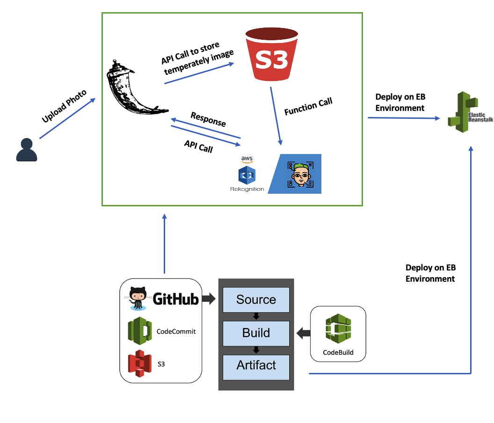

# Cloud Computing Project: Detect Celebrity From User-uploeaded Image

## Introduction

In this project, a flask web application is created and deployed using AWS Elastic Beanstalk. Following instructions on the home page, user can upload photos to the web page, and the app will detect the celebrity contained in the photo. After clicking the recognition bottom, the app will return the name of the celebrity and a link to his/her IMDB/Wikipedia page.

Link to the web app: cele-env.eba-cwnyrgph.us-east-2.elasticbeanstalk.com 

## Workflow

The app is developed using AWS Cloud9 IDE using Python, JavaScript, HTML, and CSS. Flask was used as a framework for the backend. The app was deployed through Elastic Beanstalk and is build and tested through AWS CodePipeline for continous delivery and continuous integration on the cloud.

## Demo

